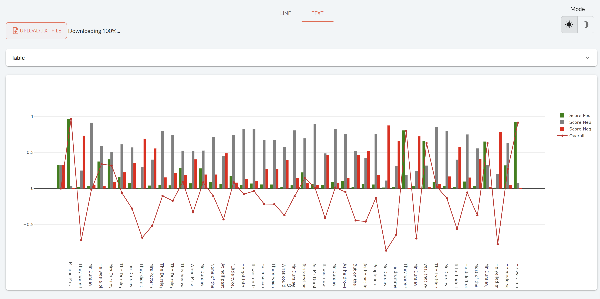

# Getting Started with Taipy GUI

!!! important "Supported Python versions"

    Taipy requires **Python 3.8** or newer.

Welcome to the **Getting Started** guide for Taipy GUI. This tour shows you how to use Taipy GUI to create an interactive Web application. Taipy GUI implements a modern backend for any data-driven application based on your business case.

{ width=700 style="margin:auto;display:block;border: 4px solid rgb(210,210,210);border-radius:7px" }

# Taipy GUI

Taipy GUI is one of the components of Taipy to create Web applications quickly. There are a lot of reasons for using Taipy GUI:

- It fastens the creation of an application.

- It manages easily and efficiently variables and events.

- Easy visualization with Markdown syntax.

Each step of the **"Getting Started"** will focus on the basic concepts of *Taipy*. Note that every step is dependent on the code of the previous one. After completing the last step, you will have the skills to develop your own Taipy 
application. 

## Before we begin

**Taipy** package requires Python 3.8 or newer;

``` console
$ pip install taipy
```

Following step 5, Taipy will utilize a Natural Language Processing (NLP) algorithm as an illustration, which is exclusively supported by Python versions 3.8 to 3.10. To have this NLP algorithm, you will need to install Transformers and Torch. However, it is possible to proceed with the Getting Started guide even without it by simply not using it.

``` console
$ pip install torch
$ pip install transformers
```

!!! info 

    `pip install taipy` is the preferred method to install the latest stable version of Taipy.
    
    If you don't have [pip](https://pip.pypa.io) installed, this 
    [Python installation guide](http://docs.python-guide.org/en/latest/starting/installation/)
    can guide you through the process.

## Using Notebooks

This **Getting Started** is for Python scripts (*.py*) only. If you want to use **Jupyter Notebooks**, download this [notebook](https://docs.taipy.io/en/latest/getting_started/getting-started-gui/getting_started.ipynb).

## Taipy Studio

Taipy Studio is a VS Code extension that provides an auto-completion of Taipy visual elements. Creating a Taipy application can be done more easily and quickly through Taipy Studio.

So, without further delay, let's begin to code!

## Steps

1. [First Web page](step_01/ReadMe.md)

2. [Visual elements](step_02/ReadMe.md)

3. [Interaction](step_03/ReadMe.md)

4. [Charts](step_04/ReadMe.md)

5. [Python expression in properties](step_05/ReadMe.md)

6. [Page layout](step_06/ReadMe.md)

7. [Multi-pages, navbars, and menus](step_07/ReadMe.md)
