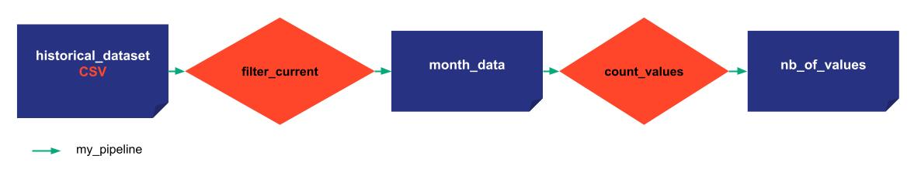

# Different types of Data Nodes:

- *Pickle* (default): Taipy can store and read anykind of data that can be serializable.

- *CSV*: Taipy can read and store any dataframe as a CSV.

- *JSON*: Taipy can read and store any JSONable data as a JSON file.

- *SQL*: Taipy can read and store a table or data base.

- *Generic*: Taipy provides a generic Data Node that can read and store any data based on the reding and writing function created by the user.

The execution graph used to explain the different concepts is quite simple.

Three Data Nodes:
- historical data: initial CSV DataFrame
- month_data: DataFrame after the filtering on the month (pd.DataFrame as a Pickle file)
- nb_of_values: number of values in this month (int as a Pickle file)

Two tasks linking these Data Nodes:
- filter: filters on the months of the dataframe
- count_values: calculates the number of elements in this month

One pipeline in a scenario gathering these two tasks

{ width=700 style="margin:auto;display:block;border: 4px solid rgb(210,210,210);border-radius:7px" }

```python
import datetime as dt
import pandas as pd
```

```python
def filter_current(df):
    current_month = dt.datetime.now().month
    df['Date'] = pd.to_datetime(df['Date']) 
    df = df[df['Date'].dt.month == current_month]
    return df

def count_values(df):
    return len(df)
```


=== "Taipy Studio/TOML configuration"

    - Create new file: 'config_03.toml'
    - Open Taipy Studio view
    - Go to the 'Config files' section of Taipy Studio
    - Right click on the right configuration
    - Choose 'Taipy: Show View'
    - Add your first Data Node by clicking the button on the right above corner of the windows
    - Create a name for it and change its details in the 'Details' section of Taipy Studio
            - name: historical_data
            - Details: default_path='xxxx/yyyy.csv', storage_type=csv
    - Do the same for the month_data and nb_of_values
            - name: output
            - Details: storage_type=pickle
    - Add a task and choose a function to associate with `<module>.<name>:function`
            -name: filter_current
            -Details: function=__main__.filter_current:function
    - Do the same for count_values
    - Link the Data Nodes and the tasks
    - Add a pipeline and link it to the tasks
    - Add a scenario and link to the pipeline


    ```python
    Config.load('config_03.toml')

    # my_scenario is the id of the scenario configured
    scenario_cfg = Config.scenarios('my_scenario')
    ```

=== "Python configuration"

    ```python
    # here is a CSV Data Node
    historical_data_cfg = Config.configure_csv_data_node(id="historical_data",
                                                         default_path="time_series.csv")
    month_values_cfg =  Config.configure_data_node(id="month_data")
    nb_of_values_cfg = Config.configure_data_node(id="nb_of_values")
    ```


    ```python
    task_filter_current_cfg = Config.configure_task(id="filter_current",
                                                     function=filter_current,
                                                     input=historical_data_cfg,
                                                     output=month_values_cfg)

    task_count_values_cfg = Config.configure_task(id="count_values",
                                                     function=count_values,
                                                     input=month_values_cfg,
                                                     output=nb_of_values_cfg)
    ```


    ```python
    pipeline_cfg = Config.configure_pipeline(id="my_pipeline",
                                             task_configs=[task_filter_current_cfg,
                                                           task_count_values_cfg])

    scenario_cfg = Config.configure_scenario(id="my_scenario",
                                             pipeline_configs=[pipeline_cfg])

    #scenario_cfg = Config.configure_scenario_from_tasks(id="my_scenario",
    #                                                    task_configs=[task_filter_current_cfg,
    #                                                                  task_count_values_cfg])
    ```


```Python
tp.Core().run()

scenario_1 = tp.create_scenario(scenario_cfg, creation_date=dt.datetime(2022,10,7), name="Scenario 2022/10/7")
scenario_1.submit()

scenario_2 = tp.create_scenario(scenario_cfg, creation_date=dt.datetime(2022,10,7), name="Scenario 2022/10/7")
scenario_2.submit()
```
Results:
```
    [2022-12-22 16:20:03,424][Taipy][INFO] job JOB_filter_current_257edf8d-3ca3-46f5-aec6-c8a413c86c43 is completed.
    [2022-12-22 16:20:03,510][Taipy][INFO] job JOB_count_values_90c9b3c7-91e7-49ef-9064-69963d60f52a is completed.
    [2022-12-22 16:20:03,755][Taipy][INFO] job JOB_filter_current_4adc91ee-cd64-4ebf-819b-8643da0282fd is completed.
    [2022-12-22 16:20:03,901][Taipy][INFO] job JOB_count_values_968c8c34-2ed4-4f89-995c-a4137af82beb is completed.
    


    {'PIPELINE_my_pipeline_b751f808-87de-4de1-866f-c1b3dd7bba19': [<taipy.core.job.job.Job at 0x219403b6080>,
      <taipy.core.job.job.Job at 0x219403b7c40>]}
```