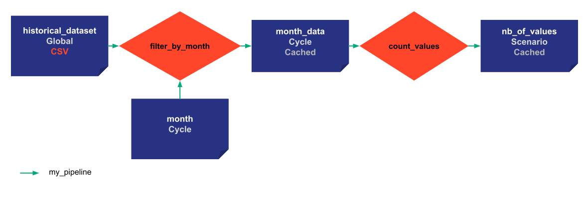

# Caching

Caching is an important feature of Taipy. Tasks can be skipped if input Data Nodes of tasks have changed or not. If none of the input Data Nodes have been changed after a first submission, tasks will be skipped. Time and ressources are saved thanks to this mechanism.


```python
def filter_by_month(df, month):
    df['Date'] = pd.to_datetime(df['Date']) 
    df = df[df['Date'].dt.month == month]
    return df

def count_values(df):
    return len(df)
```

{ width=700 style="margin:auto;display:block;border: 4px solid rgb(210,210,210);border-radius:7px" }


=== "Taipy Studio/TOML configuration"

    - Create new file: 'config_06.toml'
    - Open Taipy Studio view
    - Go to the 'Config files' section of Taipy Studio
    - Right click on the right configuration
    - Choose 'Taipy: Show View'
    - Add your first Data Node by clicking the button on the right above corner of the windows
    - Create a name for it and change its details in the 'Details' section of Taipy Studio
            - name: historical_data
            - Details: default_path=xxxx/yyyy.csv, storage_type=csv, cacheable=True:bool
    - Do the same for the month_data and nb_of_values
            - name: output
            - Details: storage_type:pickle, cacheable=True
    - Add a task and choose a function to associate with `<module>.<name>:function`
            -name: filter_current
            -Details: function=`__main__.filter_current:function`
    - Do the same for count_values
    - Link the Data Nodes and the tasks
    - Add a pipeline and link it to the tasks
    - Add a scenario and link to the pipeline
    - Add the frequency property and put "WEEKLY:FREQUENCY" (DAILY, WEEKLY, MONTHLY, YEARLY)

    ```python
    Config.load('config_06.toml')

    # my_scenario is the id of the scenario configured
    scenario_cfg = Config.scenarios('my_scenario')
    ```

=== "Python configuration"

    ```python
    historical_data_cfg = Config.configure_csv_data_node(id="historical_data",
                                                     default_path="time_series.csv",
                                                     scope=Scope.GLOBAL)
    month_cfg =  Config.configure_data_node(id="month", scope=Scope.CYCLE)
    month_values_cfg =  Config.configure_data_node(id="month_data",
                                                   scope=Scope.CYCLE,
                                                   cacheable=True)

    nb_of_values_cfg = Config.configure_data_node(id="nb_of_values",
                                                  cacheable=True)


    task_filter_by_month_cfg = Config.configure_task(id="filter_by_month",
                                                     function=filter_by_month,
                                                     input=[historical_data_cfg, month_cfg],
                                                     output=month_values_cfg)

    task_count_values_cfg = Config.configure_task(id="count_values",
                                                     function=count_values,
                                                     input=month_values_cfg,
                                                     output=nb_of_values_cfg)

    pipeline_cfg = Config.configure_pipeline(id="my_pipeline",
                                             task_configs=[task_filter_by_month_cfg,
                                                           task_count_values_cfg])

    scenario_cfg = Config.configure_scenario(id="my_scenario",
                                             pipeline_configs=[pipeline_cfg],
                                             frequency=Frequency.MONTHLY)

    #scenario_cfg = Config.configure_scenario_from_tasks(id="my_scenario",
    #                                                    task_configs=[task_filter_by_month_cfg,
    #                                                    task_count_values_cfg])
    ```

The configuration is the same. `cacheabable=True` are added to the output Data Nodes that we want to be cached.
Creation of three different scenarios with different creation dates and names.


```python
tp.Core().run()

scenario_1 = tp.create_scenario(scenario_cfg,
                                creation_date=dt.datetime(2022,10,7),
                                name="Scenario 2022/10/7")
scenario_2 = tp.create_scenario(scenario_cfg,
                               creation_date=dt.datetime(2022,10,5),
                               name="Scenario 2022/10/5")
scenario_3 = tp.create_scenario(scenario_cfg,
                                creation_date=dt.datetime(2021,9,1),
                                name="Scenario 2022/9/1")
```


```python
# scenario 1 and 2 belongs to the same cycle so 
# defining the month for scenario 1 defines the month for the scenarios in the cycle
scenario_1.month.write(10)
print("Scenario 1: month", scenario_1.month.read())
print("Scenario 2: month", scenario_2.month.read())
```

Results:
```
    Scenario 1: month 10
    Scenario 2: month 10
```

 No task has already been submitted so everything will be completed.


```python
print("Scenario 1: submit")
scenario_1.submit()
print("Value", scenario_1.nb_of_values.read())
```
Results:
```
    Scenario 1: submit
    [2022-12-22 16:20:09,079][Taipy][INFO] job JOB_filter_by_month_0d7836eb-70eb-4fe6-b954-0e56967831b6 is completed.
    [2022-12-22 16:20:09,177][Taipy][INFO] job JOB_count_values_91214241-ce81-42d8-9025-e83509652133 is completed.
    Value 849
```

When the second scenario is being executed, the first task will be skipped. Indeed, the two scenarios shares the same data nodes for this task and no input data nodes have been changed. node


```python
# first task has already been executed by scenario 1 because scenario 2 shares the same data node for this task
print("Scenario 2: first submit")
scenario_2.submit()
print("Value", scenario_2.nb_of_values.read())
```
Results:
```
    Scenario 2: first submit
    [2022-12-22 16:20:09,317][Taipy][INFO] job JOB_filter_by_month_c1db1f0c-6e0a-4691-b0a3-331d473c4c42 is skipped.
    [2022-12-22 16:20:09,371][Taipy][INFO] job JOB_count_values_271cefd0-8648-47fa-8948-ed49e93e3eee is completed.
    Value 849
```

Resubmitting the same scenario without any change will just skip every task.


```python
# every task has already been executed so everything will be skipped
print("Scenario 2: second submit")
scenario_2.submit()
print("Value", scenario_2.nb_of_values.read())
```

Results:
```
    Scenario 2: second submit
    [2022-12-22 16:20:09,516][Taipy][INFO] job JOB_filter_by_month_da2762d1-6f24-40c1-9bd1-d6786fee7a8d is skipped.
    [2022-12-22 16:20:09,546][Taipy][INFO] job JOB_count_values_9071dff4-37b2-4095-a7ed-34ef81daad27 is skipped.
    Value 849
```

This scenario is not in the same cycle. We change the month to 9 and every task will be completed. 


```python
# scenario 3 has no connection to the other scenarios so everything will be executed
print("Scenario 3: submit")
scenario_3.month.write(9)
scenario_3.submit()
print("Value", scenario_3.nb_of_values.read())
```
Results:
```
    Scenario 3: submit
    [2022-12-22 16:20:10,071][Taipy][INFO] job JOB_filter_by_month_c4d06eba-a149-4b79-9194-78972c7b7a18 is completed.
    [2022-12-22 16:20:10,257][Taipy][INFO] job JOB_count_values_817df173-6bae-4742-a2c0-b8b8eba52872 is completed.
    Value 1012
```  

Here, we change the input data node of the pipeline so Taipy will re run the correct tasks to make sure that everything is up-to-date.


```python
# changing an input data node will make the task be reexecuted
print("Scenario 3: change in historical data")
scenario_3.historical_data.write(pd.read_csv('time_series_2.csv'))
scenario_3.submit()
print("Value", scenario_3.nb_of_values.read())
```
Results:
```
    Scenario 3: change in historical data
    [2022-12-22 16:20:10,870][Taipy][INFO] job JOB_filter_by_month_92f32135-b410-41f0-b9f3-a852c2eb07cd is completed.
    [2022-12-22 16:20:10,932][Taipy][INFO] job JOB_count_values_a6a75e13-4cd4-4f7e-bc4e-d14a86733440 is completed.
    Value 1012
```
