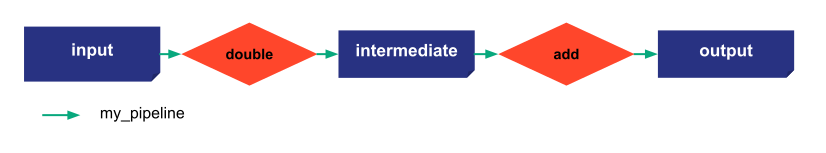

# Execution modes

Taipy has different ways to execute the code. There is two different job execution modes:
- standalone: asynchronous. Jobs can be runned in parallel depending on the graph of execution if max_nb_of_workers > 1
- development mode: synchronous

Options of submit:
- wait: if wait is True, the submit is synchronous and will wait for the end of all the jobs (if timeout is not defined)
- timeout: if wait is True, Taipy will wait for the end of the submit until a certain amount of time

```python
from taipy.core.config import Config
import taipy as tp
import datetime as dt
import pandas as pd
import time
```

```python
# Normal function used by Taipy
def double(nb):
    return nb * 2

def add(nb):
    print("Wait 10 seconds in add function")
    time.sleep(10)
    return nb + 10
```

{ width=700 style="margin:auto;display:block;border: 4px solid rgb(210,210,210);border-radius:7px" }


=== "Taipy Studio/TOML configuration"

    - Create new file: 'config_07.toml'
    - Open Taipy Studio view
    - Go to the 'Config files' section of Taipy Studio
    - Right click on the right configuration
    - Choose 'Taipy: Show View'
    - Add your first Data Node by clicking the button on the right above corner of the windows
    - Create a name for it and change its details in the 'Details' section of Taipy Studio
            - name: historical_data
            - Details: default_path=xxxx/yyyy.csv, storage_type=csv
    - Do the same for the month_data and nb_of_values
            - name: output
            - Details: storage_type:pickle, cacheable=True
    - Add a task and choose a function to associate with `<module>.<name>:function`
            -name: filter_current
            -Details: function=`__main__.filter_current:function`
    - Do the same for count_values
    - Link the Data Nodes and the tasks
    - Add a pipeline and link it to the tasks
    - Add a scenario and link to the pipeline
    - Add the frequency property and put "WEEKLY:FREQUENCY" (DAILY, WEEKLY, MONTHLY, YEARLY)

    ```python
    Config.load('config_07.toml')

    # my_scenario is the id of the scenario configured
    scenario_cfg = Config.scenarios('my_scenario')
    ```

=== "Python configuration"

    ```python

    # Configuration of Data Nodes
    input_data_node_cfg = Config.configure_data_node("input", default_data=21)
    intermediate_data_node_cfg = Config.configure_data_node("intermediate", default_data=21)
    output_data_node_cfg = Config.configure_data_node("output")

    # Configuration of tasks
    first_task_cfg = Config.configure_task("double",
                                        double,
                                        input_data_node_cfg,
                                        intermediate_data_node_cfg)

    second_task_cfg = Config.configure_task("add",
                                        add,
                                        intermediate_data_node_cfg,
                                        output_data_node_cfg)

    # Configuration of the pipeline and scenario
    pipeline_cfg = Config.configure_pipeline("my_pipeline", [first_task_cfg, second_task_cfg])
    scenario_cfg = Config.configure_scenario("my_scenario", [pipeline_cfg])

    #scenario_cfg = Config.configure_scenario_from_tasks(id="my_scenario",
    #                                                    task_configs=[first_task_cfg, second_task_cfg])
    ```


```python
Config.configure_job_executions(mode="standalone", max_nb_of_workers=2)
```

Results:
```
    <taipy.core.config.job_config.JobConfig at 0x2193e63c3d0>
```


```python
if __name__=="__main__":
    tp.Core().run()
    scenario_1 = tp.create_scenario(scenario_cfg)
    scenario_1.submit()
    scenario_1.submit()

    time.sleep(30)
```


```python
if __name__=="__main__":
    tp.Core().run()
    scenario_1 = tp.create_scenario(scenario_cfg)
    scenario_1.submit(wait=True)
    scenario_1.submit(wait=True, timeout=5)
```
