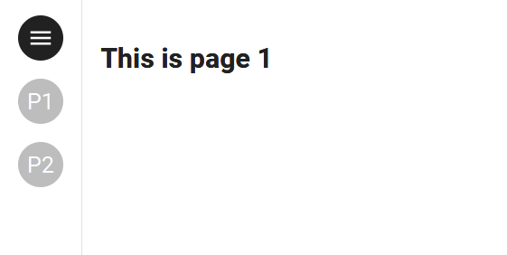

## Step 7: Multi-pages, navbar and menus

The creation of a multi-page application is greatly simplified through Taipy.

In order to create a multi-page application, a dictionnary of pages has to be specified in the definition of the GUI.


- [menu](https://docs.taipy.io/en/latest/manuals/gui/viselements/menu/): creates a menu on the left to navigate through the pages.

`<|menu|label=Menu|lov={lov_pages}|on_action=on_menu|>`. For example, this code creates a menu with two pages:

```python
from taipy import Gui

def on_menu():
    print('Menu function called')

Gui(page="<|menu|label=Menu|lov={['Data Visualization', 'Scenario Manager']}|on_action=on_menu|>").run()
```

{ width=50 style="margin:auto;display:block" }

- [navbar](): creates an element to navigate through the Taipy pages by default


```python
from taipy import Gui

root_md="# Multi-page application"
page1_md="## This is page 1"
page2_md="## This is page 2"

pages = {
    "/": root_md,
    "page1": page1_md,
    "page2": page2_md
}
Gui(pages=pages).run()
```

Pages 1 and 2 will share the content of the root page. Visual elements like menu or navbar are usually put in this root page to navigate between the different pages of the application.

```python
from transformers import AutoTokenizer
from transformers import AutoModelForSequenceClassification
from scipy.special import softmax

import numpy as np
import pandas as pd 
from taipy.gui import Gui, notify

# First page
text = "Orginal text"

MODEL = f"cardiffnlp/twitter-roberta-base-sentiment"
tokenizer = AutoTokenizer.from_pretrained(MODEL)
model = AutoModelForSequenceClassification.from_pretrained(MODEL)

dataframe = pd.DataFrame({"Text":[''],
                          "Score Pos":[0],
                          "Score Neu":[0],
                          "Score Neg":[0],
                          "Overall":[0]})

page = """
# Getting started with Taipy GUI

<|layout|columns=1 1|
<|
My text: <|{text}|>

Enter a word:

<|{text}|input|>

<|Analyze|button|on_action=local_callback|>
|>


<|Table|expandable|
<|{dataframe}|table|width=100%|>
|>

|>

<|layout|columns=1 1 1|
<|
## Positive
<|{np.mean(dataframe['Score Pos'])}|>
|>

<|
## Neutral
<|{np.mean(dataframe['Score Neu'])}|>
|>

<|
## Negative
<|{np.mean(dataframe['Score Neg'])}|>
|>
|>

<|{dataframe}|chart|type=bar|x=Text|y[1]=Score Pos|y[2]=Score Neu|y[3]=Score Neg|y[4]=Overall|color[1]=green|color[2]=grey|color[3]=red|type[4]=line|>
"""


def analize_text(text):
    # Run for Roberta Model
    encoded_text = tokenizer(text, return_tensors='pt')
    output = model(**encoded_text)
    scores = output[0][0].detach().numpy()
    scores = softmax(scores)
    
    return {"Text":text[:50],
            "Score Pos":scores[2],
            "Score Neu":scores[1],
            "Score Neg":scores[0],
            "Overall":scores[2]-scores[0]}


def local_callback(state):
    print(state.text)
    notify(state, 'Info', f'The text is: {state.text}', True)
    temp = state.dataframe.copy()
    scores = analize_text(state.text)
    state.dataframe = temp.append(scores, ignore_index=True)
    state.text = ""


# Second page

dataframe2 = dataframe.copy()
path = ""
treatment = 0

page_file = """
<|{path}|file_selector|extensions=.txt|label=Upload .txt file|on_action=analyze_file|> <|{f'Downloading {treatment}%...'}|>


<|Table|expandable|
<|{dataframe2}|table|width=100%|>
|>

<|{dataframe2}|chart|type=bar|x=Text|y[1]=Score Pos|y[2]=Score Neu|y[3]=Score Neg|y[4]=Overall|color[1]=green|color[2]=grey|color[3]=red|type[4]=line|height=800px|>

"""

def analyze_file(state):
    state.dataframe2 = dataframe2
    state.treatment = 0
    with open(state.path,"r", encoding='utf-8') as f:
        print(f)
        data = f.read()
        # split lines and eliminates duplicates
        file_list = list(dict.fromkeys(data.replace('\n', ' ').split(".")[:-1]))
    
    
    for i in range(len(file_list)):
        text = file_list[i]
        state.treatment = int((i+1)*100/len(file_list))
        print(text)
        temp = state.dataframe2.copy()
        scores = analize_text(text)
        state.dataframe2 = temp.append(scores, ignore_index=True)
        
    state.path = None
    


# One root page for common content
# The two pages that was created
pages = {"/":"<|toggle|theme|>\n<center>\n<|navbar|>\n</center>",
         "line":page,
         "text":page_file}


Gui(pages=pages).run()
```
