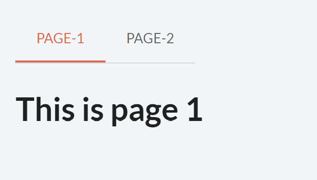
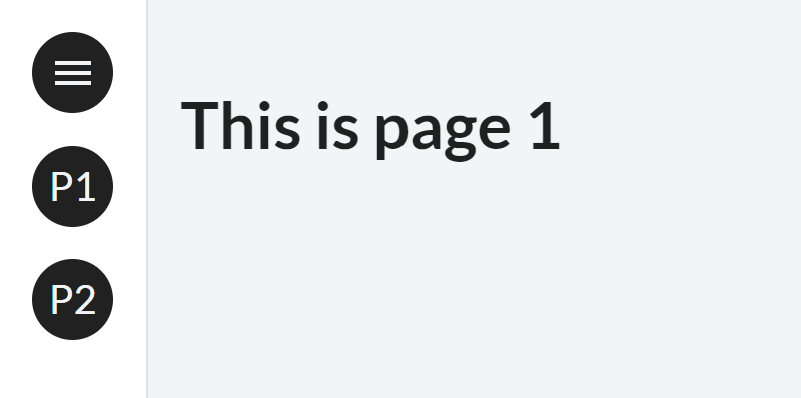

## Step 7: Multi-pages, navbars, and menus

The creation of a multi-page application is greatly simplified through Taipy. To create a multi-page application, a dictionary of pages has to be specified in the definition of the GUI. Pages 1 and 2 will share the content of the root page. Visual elements like a menu or navbar are usually put on this root page to navigate between the different pages of the application.


```python
from taipy import Gui

root_md="# Multi-page application"
page1_md="## This is page 1"
page2_md="## This is page 2"

pages = {
    "/": root_md,
    "page1": page1_md,
    "page2": page2_md
}
Gui(pages=pages).run()
```

## Navigating between pages

- [menu](https://docs.taipy.io/en/latest/manuals/gui/viselements/menu/): creates a menu on the left to navigate through the pages.

`<|menu|label=Menu|lov={lov_pages}|on_action=on_menu|>`. For example, this code creates a menu with two pages:

```python
from taipy.gui import Gui, navigate


root_md="<|menu|label=Menu|lov={[('Page-1', 'Page 1'), ('Page-2', 'Page 2')]}|on_action=on_menu|>"
page1_md="## This is page 1"
page2_md="## This is page 2"


def on_menu(state, var_name, function_name, info):
    page = info['args'][0]
    navigate(state, to=page)
   
   
pages = {
    "/": root_md,
    "Page-1": page1_md,
    "Page-2": page2_md
}

Gui(pages=pages).run()
```

{ width=50 style="margin:auto;display:block" }

- [navbar](): creates an element to navigate through the Taipy pages by default

```python
from taipy.gui import Gui


root_md="<|navbar|>"
page1_md="## This is page 1"
page2_md="## This is page 2"

pages = {
    "/": root_md,
    "Page-1": page1_md,
    "Page-2": page2_md
}

Gui(pages=pages).run()
```
 
{ width=50 style="margin:auto;display:block" }

 
## Back to the code

In our application, the first page (named _page_) contains the previous Markdown.

{ width=700 style="margin:auto;display:block;border: 4px solid rgb(210,210,210);border-radius:7px" }

Then, let’s create our second page, which contains a page to analyze an entire text.

```python
# Second page

dataframe2 = dataframe.copy()
path = ""
treatment = 0

page_file = """
<|{path}|file_selector|extensions=.txt|label=Upload .txt file|on_action=analyze_file|> <|{f'Downloading {treatment}%...'}|>


<|Table|expandable|
<|{dataframe2}|table|width=100%|>
|>

<|{dataframe2}|chart|type=bar|x=Text|y[1]=Score Pos|y[2]=Score Neu|y[3]=Score Neg|y[4]=Overall|color[1]=green|color[2]=grey|color[3]=red|type[4]=line|height=800px|>

"""

def analyze_file(state):
    state.dataframe2 = dataframe2
    state.treatment = 0
    with open(state.path,"r", encoding='utf-8') as f:
        data = f.read()
        # split lines and eliminates duplicates
        file_list = list(dict.fromkeys(data.replace('\n', ' ').split(".")[:-1]))
    
    
    for i in range(len(file_list)):
        text = file_list[i]
        state.treatment = int((i+1)*100/len(file_list))
        temp = state.dataframe2.copy()
        scores = analize_text(text)
        state.dataframe2 = temp.append(scores, ignore_index=True)
        
    state.path = None
```    

This little code below assembles our previous page and this new page. The _navbar_ in the root page is present in both pages and is automatically able to switch pages through it. 

```python

# One root page for common content
# The two pages that were created
pages = {"/":"<|toggle|theme|>\n<center>\n<|navbar|>\n</center>",
         "line":page,
         "text":page_file}


Gui(pages=pages).run()
```
