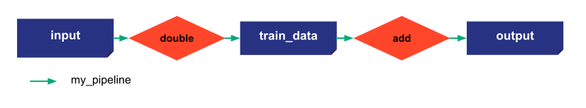

# Other features

This step reuses the configuration provided in the previous step except for the scenario configuration.

{ width=700 style="margin:auto;display:block;border: 4px solid rgb(210,210,210);border-radius:7px" }

## Callback on scenarios

To have an action after the change of a job status, we can subscribe a function to a scenario. This function will be called each time a job has its status changed.

```python
def callback_scenario(scenario, job):
    """All the scenarios are subscribed to the callback_scenario_state function. It means whenever a job is done, it is called.

    Args:
        scenario (Scenario): the scenario of the job changed
        job (_type_): the job that has its status changed
    """
    print(scenario.name)
    if job.status.value == 7:
        for data_node in job.task.output.values():
            print(data_node.read())

```

## Comparison of funtions

Taipy provides a way to compare scenarios by providing a function directly into the configuration of the scenario.

_data_node_results_ is a list of data nodes from all scenarios passed in the comparator. We iterate through it to compare scenarios.


```python
def compare_function(*data_node_results):
    compare_result= {}
    current_res_i = 0
    for current_res in data_node_results:
        compare_result[current_res_i]={}
        next_res_i = 0
        for next_res in data_node_results:
            print(f"comparing result {current_res_i} with result {next_res_i}")
            compare_result[current_res_i][next_res_i] = next_res - current_res
            next_res_i += 1
        current_res_i += 1
    return compare_result
```

The Data Node that will be compared here is the 'month' Data Node. It is indicated in the comparators parameter of the _configure_scenario_.


```python
scenario_cfg = Config.configure_scenario("multiply_scenario",
                                        [pipeline_cfg],
                                        comparators={month_cfg.id: compare_function},
                                        frequency=Frequency.MONTHLY)

#scenario_cfg = Config.configure_scenario_from_tasks(id="my_scenario",
#                                                    task_configs=[task_filter_by_month_cfg,
#                                                                  task_count_values_cfg])
```


```python
tp.Core().run()

scenario_1 = tp.create_scenario(scenario_cfg)
scenario_2 = tp.create_scenario(scenario_cfg)


print("\nScenario 1: submit")
scenario_1.submit()
print("Value", scenario_1.output.read())

print("\nScenario 2: first submit")
scenario_2.submit()
print("Value", scenario_2.output.read())


print(tp.compare_scenarios(scenario_1, scenario_2))
```

## Taipy Rest

Taipy Rest allows the user to navigate through the entities of the application but also create and submit scenarios. Try the following commands:

- 
- 
- 
- 


```python
tp.Rest().run()
```


